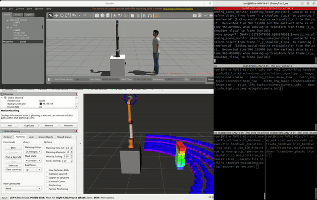

# Testing in Simulation
To test this package in a simulated UR10e environment—which includes the integrated camera and LiDAR sensor—we have developed a dedicated simulation environment featuring a UR10e manipulator and a human model.

You can access the simulation repository here:
**[UR10e Simulation Repository](https://github.com/nikolaslps/ur_gazebo_sim)**

## Quick Start
1. **Setup Simulation**: Clone the repository above and follow the instructions in its `README.md` to launch the environment.

2. **Testing Modules**: To test the `kiro_handover_execution` module, please follow the specific instructions in our [Docker Documentation](../docker/Docker-Install.md).

> [!WARNING]
> **Mandatory Dependency**: The `kiro_handover_execution` module requires real-time handover volume data to function. Therefore, it is **mandatory** to have the `kiro_handover_calculation` container running and publishing data to the appropriate topics before starting the execution module. 
> 
> Failing to run the calculation container will result in the execution module failing to initialize its motion planning goals.

> [!NOTE]
> The only difference when launching the simulation is the specific launch parameters here:
> ```bash
> ros2 run kiro_handover_execution handover_execution --ros-args -p use_sim_time:=true -p move_group_name:=ur_manipulator -p use_collision_capsules:=false --params-file src/kiro_handover_execution/config/handover_params.yaml 
> ```

> [!IMPORTANT]
> Remember to trigger the handover pipeline to start using the following service:
> ```bash
> ros2 service call /activate_handover kiro_handover_interfaces/srv/ActivateHandover "{handover_phase: true}"
> ```

## Verification
Upon a successful launch, you should expect terminal output similar to the following:
```
[INFO] [1782650095.748113180] [point_cloud_observer]: Subscribed to point cloud: /filtered_cloud
[INFO] [1782650095.954341569] [moveit_rdf_loader.rdf_loader]: Loaded robot model in 0.206175 seconds
[INFO] [1782650095.954382344] [moveit_robot_model.robot_model]: Loading robot model 'ur'...
[INFO] [1782650095.954389146] [moveit_robot_model.robot_model]: No root/virtual joint specified in SRDF. Assuming fixed joint
[INFO] [1782650095.977994561] [moveit_kinematics_base.kinematics_base]: IK Using joint shoulder_link -6.28319 6.28319
[INFO] [1782650095.978023384] [moveit_kinematics_base.kinematics_base]: IK Using joint upper_arm_link -6.28319 6.28319
[INFO] [1782650095.978030838] [moveit_kinematics_base.kinematics_base]: IK Using joint forearm_link -3.14159 3.14159
[INFO] [1782650095.978035196] [moveit_kinematics_base.kinematics_base]: IK Using joint wrist_1_link -6.28319 6.28319
[INFO] [1782650095.978039374] [moveit_kinematics_base.kinematics_base]: IK Using joint wrist_2_link -6.28319 6.28319
[INFO] [1782650095.978043181] [moveit_kinematics_base.kinematics_base]: IK Using joint wrist_3_link -6.28319 6.28319
[INFO] [1782650095.978050204] [moveit_kinematics_base.kinematics_base]: Using solve type Distance
[INFO] [1782650096.010886720] [moveit_ros.planning_scene_monitor.planning_scene_monitor]: Starting planning scene monitor
[INFO] [1782650096.020415502] [moveit_ros.planning_scene_monitor.planning_scene_monitor]: Listening to '/monitored_planning_scene'
[INFO] [1782650096.053113574] [moveit_rdf_loader.rdf_loader]: Loaded robot model in 0.0324898 seconds
[INFO] [1782650096.053145854] [moveit_robot_model.robot_model]: Loading robot model 'ur'...
[INFO] [1782650096.053151124] [moveit_robot_model.robot_model]: No root/virtual joint specified in SRDF. Assuming fixed joint
[INFO] [1782650096.062313188] [moveit_kinematics_base.kinematics_base]: IK Using joint shoulder_link -6.28319 6.28319
[INFO] [1782650096.062335910] [moveit_kinematics_base.kinematics_base]: IK Using joint upper_arm_link -6.28319 6.28319
[INFO] [1782650096.062340950] [moveit_kinematics_base.kinematics_base]: IK Using joint forearm_link -3.14159 3.14159
[INFO] [1782650096.062344536] [moveit_kinematics_base.kinematics_base]: IK Using joint wrist_1_link -6.28319 6.28319
[INFO] [1782650096.062348434] [moveit_kinematics_base.kinematics_base]: IK Using joint wrist_2_link -6.28319 6.28319
[INFO] [1782650096.062352752] [moveit_kinematics_base.kinematics_base]: IK Using joint wrist_3_link -6.28319 6.28319
[INFO] [1782650096.062359694] [moveit_kinematics_base.kinematics_base]: Using solve type Distance
[INFO] [1782650096.069076522] [move_group_interface]: Ready to take commands for planning group ur_manipulator.
[INFO] [1782650096.069602494] [moveit_ros.current_state_monitor]: Listening to joint states on topic 'joint_states'
[INFO] [1782650101.127571402] [path_visualizer]: PathVisualizer ready. Topic: /handover/BezierCurves  Frame: world
[INFO] [1782650101.127725877] [handover_execution]: UR base in planning frame: [0.000, 0.000, 0.800]
[INFO] [1782650101.127752547] [workspace_checker]: WorkspaceChecker ready — UR10e base at [0.000, 0.000, 0.800]  reach=[0.250, 1.000] m
[INFO] [1782650101.131792841] [handover_execution]: Execution Node spinning. Ready for trigger on '/activate_handover'
```

## System Visualization
1. No visualization of Octomap
<table>
  <tr>
    <td></td>
    <td></td>
  </tr>
  <tr>
    <td align="center"><b>Figure 1:</b> Motion planning visualization in RViz</td>
    <td align="center"><b>Figure 2:</b> Successfully arrived at the optimal handover pose</td>
  </tr>
</table>

2. With Octomap visualization
<table>
  <tr>
    <td></td>
    <td></td>
  </tr>
  <tr>
    <td align="center"><b>Figure 3:</b> Motion planning visualization in RViz with Octomap</td>
    <td align="center"><b>Figure 4:</b> Successfully arrived at the optimal handover pose</td>
  </tr>
</table>

## Handover execution demonstration

### 1. First terminal: `ur_gazebo_sim`
### 2. Second terminal: `kiro_handover_calculation`
### 3. Third terminal: `kiro_handover_execution`
### 4. Forth terminal: The handover activation service (`ActivateHandover`)

<div align="center">
  
  <p><b>Figure 5:</b> Handover execution demonstration</p>
</div>