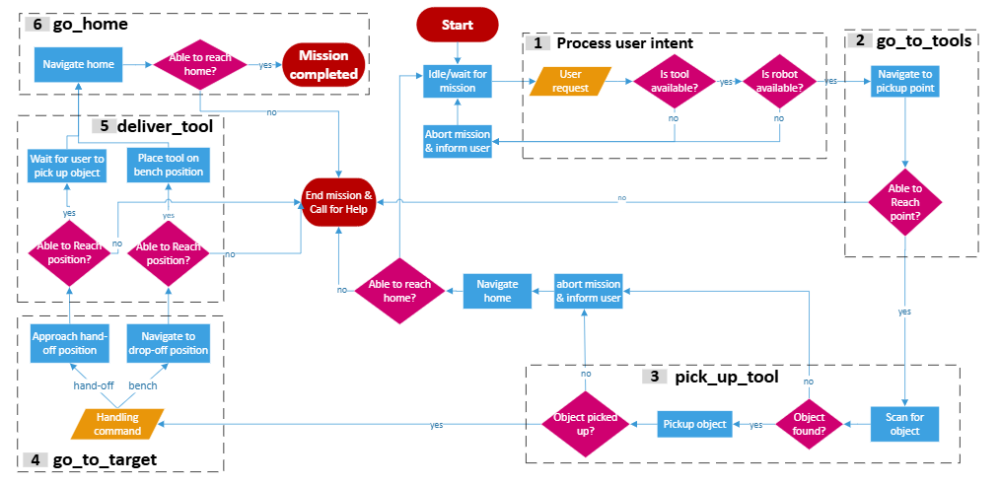
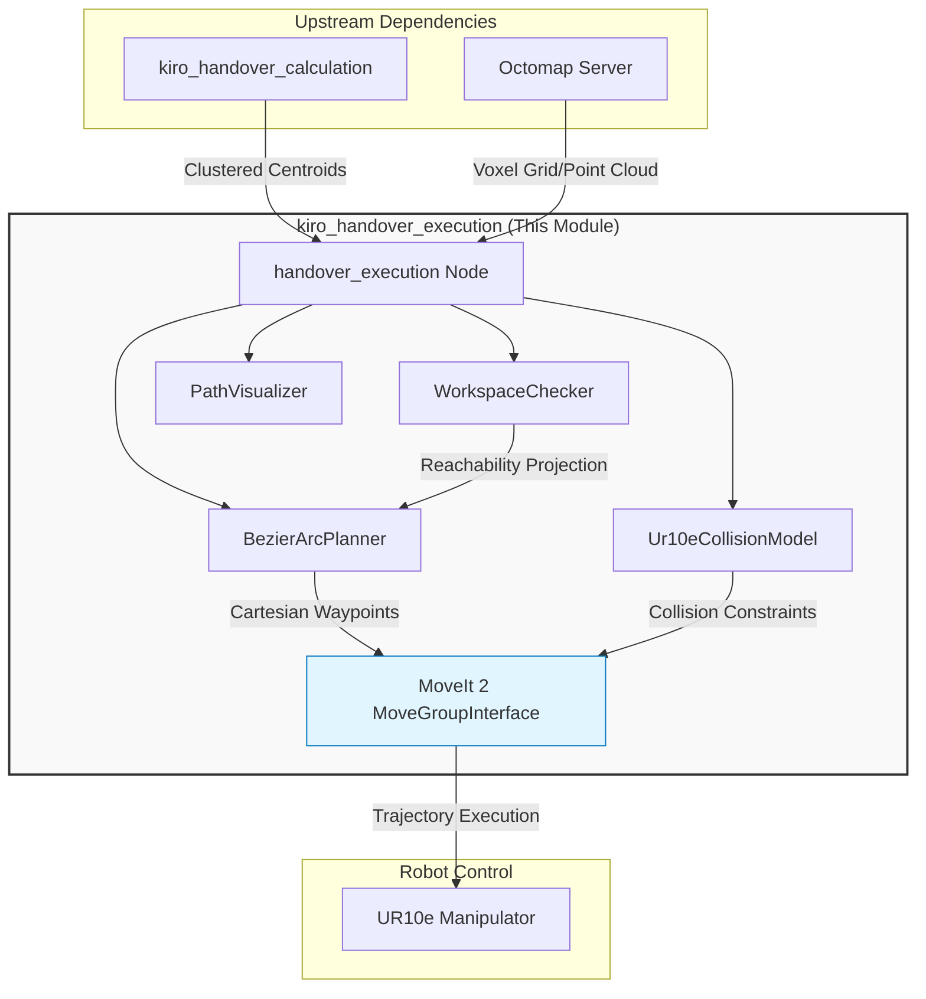
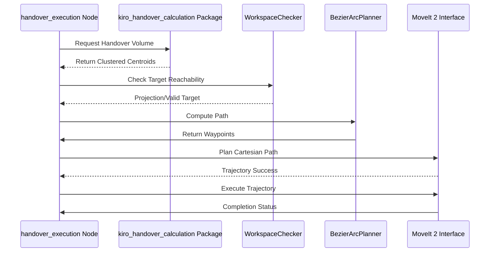
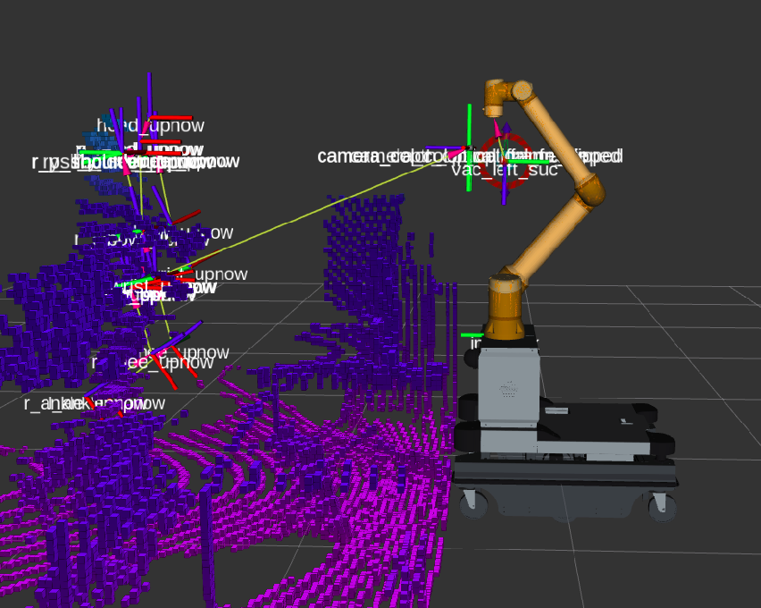
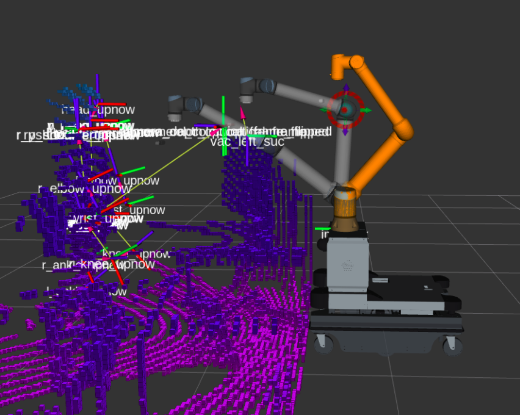
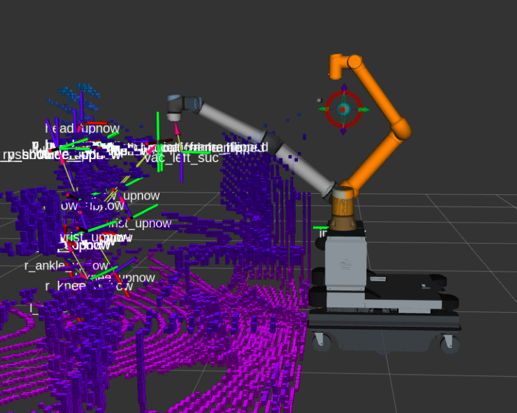

# Role in the TRL 6-7 Demonstrator

This module functions as the real-time execution core of the ARISE-KIRO collaborative workstation platform. Within the Technology Readiness Level (TRL) 6-7 pilot cell assembly, it processes computed interaction volumes to perform collision-free path planning, providing safety-monitored trajectory deployment to the UR10e manipulator during physical operator handovers.

## 1 Structural Runtime Execution Flow
The diagram below provides the overall flow of actions and high-level states during the execution of the KIRO collaborative task. The `kiro_handover_execution` module activates during the `deliver_tool` phase (Step 5 in the diagram), specifically when performing a `hand-off` to a human worker, rather than a delivery to a workbench.

<table>
  <tr>
    <td align="center"></td>
  </tr>
  <tr>
    <td align="center"><b>Figure 1:</b> Diagram of the robot’s workflow.</td>
  </tr>
</table>

### 1.2 System Architectural Diagram 
This diagram maps the internal logic of the `kiro_handover_execution` package, highlighting the interaction between trajectory planners, collision models, and the MoveIt 2 interface.

### 1.3 System Sequence Diagram
This sequence demonstrates the logic flow when the execution node initiates a move to a handover point.

## 2 System Validation 

The `kiro_handover_execution` framework was validated using a dual-stage testing pipeline designed to systematically isolate algorithmic compliance before full-scale physical deployment:

### 2.1 High-Fidelity Simulation Verification
Initial validation was performed within a high-fidelity **Gazebo** simulation environment integrated with the **MoveIt 2** planning scene. This stage successfully verified:
* **Collision Avoidance:** The capsule-based bounding volumes (`Ur10eCollisionModel`) and point cloud slicing successfully parsed simulated obstacles, safely avoiding collisions with them.
* **Kinematic Solvability:** The `trac_ik` solver plugin reliably converged on continuous joint configurations across diverse task-space trajectory profiles.

### 2.2 Path Planning Sequence with Active Octomap Server
To verify real-time path generation under environment constraints, the pipeline was audited across a continuous execution sequence under active Octomap monitoring. This sequential process is documented across Figures 1 through 3:

* **Figure 1: Initial Workspace Sensing & Target Extraction** The tracking stack initializes inside the warehouse environment, capturing environment topology via the active Octomap server (using the Bpearl 3D Lidar). The human skeletal frames are anchored, and the system samples candidates for the upcoming interaction, laying out the initial geometric target array.

* **Figure 2: Trajectory Generation & Obstacle Clearance Mapping** As a physical box obstacle populates the workspace, the point cloud updater inserts voxel blocks into the planning scene. The MoveIt2 interface plans an optimized, collision-free waypoint trajectory.

* **Figure 3: Final Approach & Reachability Verification** The UR10e manipulator executes the safe trajectory resulting in a successful end-effector arrival at the handoff point.

### 2.3 Inter-Package Communication & Pipeline Orchestration
The dual-stage pipeline explicitly verified the distributed service-client handshake between `kiro_handover_execution` and the upstream `kiro_handover_calculation` perception package:
* **The Handshake Loop:** The execution engine successfully managed the runtime transition—triggering the tracking package via `/activate_handover_calc`, querying the tracked human via `/get_active_body_id`, and extracting discrete, clustered target coordinates via `/cluster_handover_volume`.

