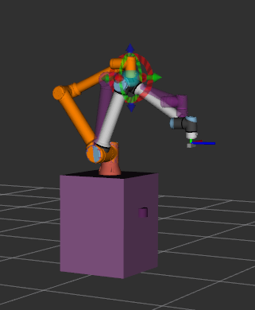
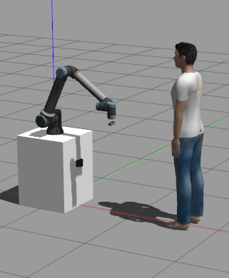
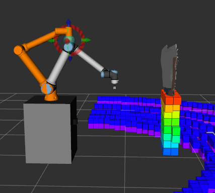
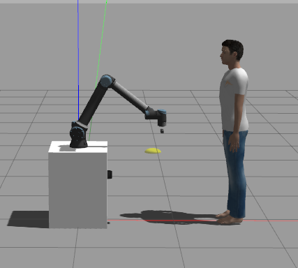

# Testing in Simulation
To test this package in a simulated UR10e environment—which includes the integrated camera and LiDAR sensor—we have developed a dedicated simulation environment featuring a UR10e manipulator and a human model.

You can access the simulation repository here:
**[UR10e Simulation Repository](https://github.com/nikolaslps/ur_gazebo_sim)**

## Quick Start
1. **Setup Simulation**: Clone the repository above and follow the instructions in its `README.md` to launch the environment.

2. **Testing Modules**: To test the `kiro_handover_execution` module, please follow the specific instructions in our [Docker Documentation](../docker/Docker-Install.md).

> [!WARNING]
> **Mandatory Dependency**: The `kiro_handover_execution` module requires real-time handover volume data to function. Therefore, it is **mandatory** to have the `kiro_handover_calculation` container running and publishing data to the appropriate topics before starting the execution module. 
> 
> Failing to run the calculation container will result in the execution module failing to initialize its motion planning goals.

> [!NOTE]
> The only difference when launching the simulation is the specific launch parameters here:
> ```bash
> ros2 run kiro_handover_execution handover_execution --ros-args -p use_sim_time:=true -p move_group_name:=ur_manipulator -p use_collision_capsules:=false --params-file src/kiro_handover_execution/config/handover_params.yaml 
> ```

> [!IMPORTANT]
> Remember to trigger the handover pipeline to start using the following service:
> ```bash
> ros2 service call /activate_handover kiro_handover_interfaces/srv/ActivateHandover "{handover_phase: true}"
> ```

## System Visualization
1. No visualization of Octomap
<table>
  <tr>
    <td></td>
    <td></td>
  </tr>
  <tr>
    <td align="center"><b>Figure 1:</b> Motion planning visualization in RViz</td>
    <td align="center"><b>Figure 2:</b> Successfully arrived at the optimal handover pose</td>
  </tr>
</table>

2. With Octomap visualization
<table>
  <tr>
    <td></td>
    <td></td>
  </tr>
  <tr>
    <td align="center"><b>Figure 1:</b> Motion planning visualization in RViz with Octomap</td>
    <td align="center"><b>Figure 2:</b> Successfully arrived at the optimal handover pose</td>
  </tr>
</table>